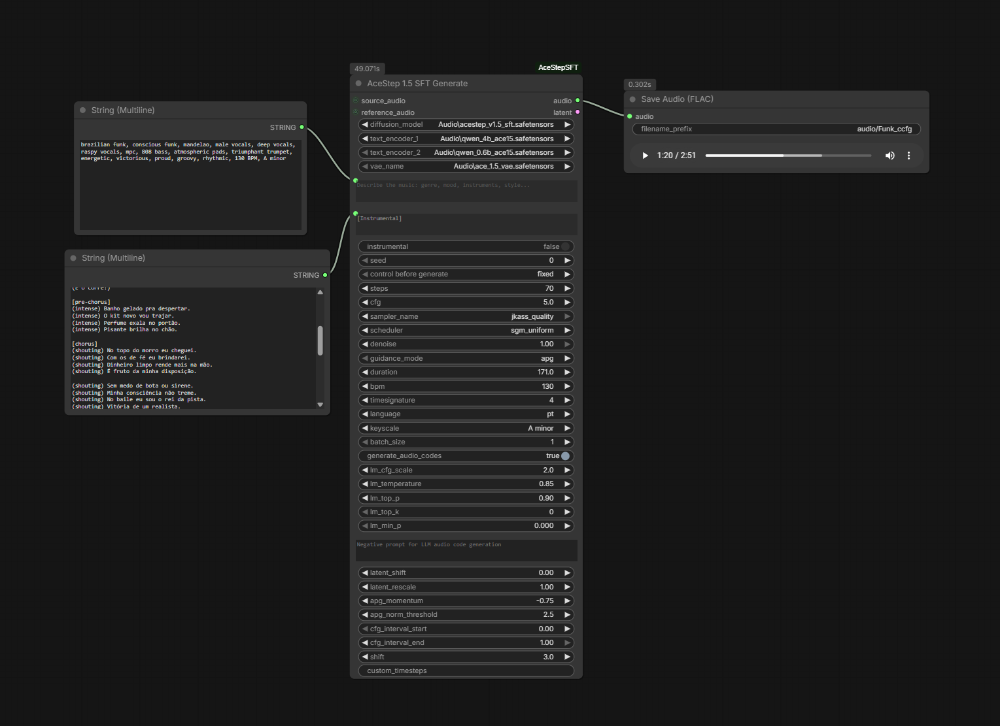

# ComfyUI-AceStep SFT

[](https://opensource.org/licenses/MIT)
[](https://www.python.org/downloads/)

Um node all-in-one para [ComfyUI](https://github.com/comfyanonymous/ComfyUI) que implementa **AceStep 1.5 SFT** (Supervised Fine-Tuning), um modelo de geração de música de alta qualidade. Este node replica a funcionalidade completa do pipeline oficial do Gradio, oferecendo controle fino sobre os parâmetros de síntese de áudio.

> **SFT = Supervised Fine-Tuning**: Uma versão especializada do AceStep otimizada para gerar áudio com qualidade superior através de treinamento supervisionado.

## 📋 Visão Geral

O **AceStepSFTGenerate** é um node unificado que encapsula todo o fluxo de trabalho de geração de música:

1. **Criação de Latentes** - Gera latentes iniciais ou carrega a partir de áudio fonte
2. **Codificação de Texto** - Processa caption, letras e metadados via múltiplos encoders CLIP
3. **Amostragem de Difusão** - Executa o diffusion model com controle avançado de guidance
4. **Decodificação de Áudio** - Converte latentes em áudio de alta qualidade via VAE

### Exemplo de Uso



## 🎯 Recursos Principais

### ✨ Guidance Avançada

O node suporta três modos de guidance classif-livres, cada um com características únicas:

- **APG (Adaptive Projected Guidance)** ⭐ *Recomendado*
  - Adaptação dinâmica baseada em momentum
  - Clipping de gradientes com threshold adaptativo
  - Projeção ortogonal para evitar ruído indesejado
  - **Padrão do AceStep SFT** - oferece o melhor equilíbrio entre qualidade e estabilidade

- **ADG (Angle-based Dynamic Guidance)**
  - Guidance baseada em ângulos cosine entre condições
  - Operação em espaço de velocidade (flow matching)
  - Ideal para distorção de estilo mais agressiva
  - Clipping adaptativo baseado no ângulo entre x0_cond e x0_uncond

- **Standard CFG**
  - Classifier-Free Guidance tradicional
  - Implementação simples e previsível
  - Útil como baseline de comparação

### 🎵 Processamento Inteligente de Metadados

- **Auto-duração**: Estima automaticamente a duração da música analisando a estrutura das letras
- **Codificação LLM**: Utilize Qwen LLM (0.6B ou 1.7B/4B) para gerar códigos semânticos de áudio
- **Valores Auto**: BPM, Time Signature e Key/Scale automáticos (modelo decide)
- **Suporte multilíngue**: Mais de 23 idiomas suportados

### 🔄 Edição e Transferência de Estilo

- **Denoising de Áudio Fonte**: Use `denoise < 1.0` com áudio fonte para edição
- **Transferência de Timbre**: Áudio de referência para transferência de estilo
- **Tamanho de Lote**: Gere múltiplas variações em paralelo

### 🛠️ Pós-processamento Latente

- **Latent Shift**: Correção anti-clipping aditiva
- **Latent Rescale**: Scaling multiplicativo para controle dinâmico

## 📦 Instalação

### Pré-requisitos

- ComfyUI instalado e funcional
- CUDA/GPU ou equivalente (processadores modernos)
- Models necessários:
  - Diffusion model: `acestep_v1.5_sft.safetensors`
  - Text Encoders: `qwen_0.6b_ace15.safetensors` e `qwen_1.7b_ace15.safetensors` (ou 4B)
  - VAE: `ace_1.5_vae.safetensors`

### Passos

1. Clone o repositório na pasta de custom nodes:
```bash
cd ComfyUI/custom_nodes
git clone https://github.com/seu-usuario/ComfyUI-AceStep_SFT.git
```

2. Os arquivos de modelo devem ser colocados em:
```
ComfyUI/models/diffusion_models/     # arquivo .safetensors do model DiT
ComfyUI/models/text_encoders/        # arquivos dos encoders CLIP
ComfyUI/models/vae/                  # arquivo da VAE
```

3. Reinicie o ComfyUI - o node aparecerá em `audio/AceStep SFT`

## 🎛️ Parâmetros do Node

### Parametros Obrigatórios

| Parâmetro | Intervalo | Descrição |
|-----------|-----------|-----------|
| **diffusion_model** | - | Caminho do modelo DiT (AceStep 1.5 SFT) |
| **text_encoder_1** | - | Encoder Qwen3 0.6B (processamento de caption) |
| **text_encoder_2** | - | Encoder Qwen3 1.7B/4B (LLM para códigos de áudio) |
| **vae_name** | - | VAE do AceStep 1.5 |
| **caption** | - | Descrição textual da música (gênero, mood, instrumentos) |
| **lyrics** | - | Letras ou `[Instrumental]` |
| **instrumental** | boolean | Força modo instrumental (sobrescreve letras) |
| **seed** | 0 - 2^64 | Seed para reprodutibilidade |
| **steps** | 1 - 200 | Passos de difusão (padrão: 32) |
| **cfg** | 1.0 - 20.0 | Classifier-free guidance scale (padrão: 7.0) |
| **sampler_name** | - | Sampler (euler, dpmpp, etc.) |
| **scheduler** | - | Scheduler (karras, exponential, etc.) |
| **denoise** | 0.0 - 1.0 | Força de denoising (1.0 = novo, < 1.0 = edição) |
| **guidance_mode** | apg/adg/standard_cfg | Tipo de guidance (padrão: apg) |
| **duration** | 0.0 - 600.0 | Duração em segundos (0 = auto) |
| **bpm** | 0 - 300 | BPM (0 = auto, modelo decide) |
| **timesignature** | auto/2/3/4/6 | Numerador da fórmula de compasso |
| **language** | - | Idioma da letra (en, ja, zh, es, pt, etc.) |
| **keyscale** | auto/... | Tom e escala ex: "C major" ou "D minor" |

### Parâmetros Opcionais

#### Geração em Lote
- **batch_size** (1-16): Número de áudios para gerar em paralelo

#### Entradas de Áudio
- **source_audio**: Áudio para denoising/edição com `denoise < 1.0`
- **reference_audio**: Áudio de referência para transferência de timbre/estilo

#### Configuração LLM (Geração de Códigos de Áudio)
- **generate_audio_codes** (default: True): Ativar/desativar geração LLM
- **lm_cfg_scale** (0.0-100.0, default: 2.0): CFG scale para LLM
- **lm_temperature** (0.0-2.0, default: 0.85): Temperatura de sampling
- **lm_top_p** (0.0-2000.0, default: 0.9): Nucleus sampling
- **lm_top_k** (0-100, default: 0): Top-k sampling
- **lm_min_p** (0.0-1.0, default: 0.0): Minimum probability
- **lm_negative_prompt**: Prompt negativo para CFG do LLM

#### Pós-processamento de Latentes
- **latent_shift** (-0.2-0.2, default: 0.0): Shift aditivo (anti-clipping)
- **latent_rescale** (0.5-1.5, default: 1.0): Scaling multiplicativo

#### Configuração APG
- **apg_momentum** (-1.0-1.0, default: -0.75): Coeficiente do buffer de momentum
- **apg_norm_threshold** (0.0-10.0, default: 2.5): Threshold de norma para clipping

#### Intervalo de Guidance
- **cfg_interval_start** (0.0-1.0, default: 0.0): Iniciar guidance nesta fração do schedule
- **cfg_interval_end** (0.0-1.0, default: 1.0): Parar guidance nesta fração do schedule

#### Timesteps Personalizados
- **shift** (1.0-5.0, default: 3.0): Shift do schedule (3.0 = padrão Gradio)
- **custom_timesteps**: Timesteps customizados em formato CSV (ex: `0.97,0.76,0.615,...`)

## 🔍 Como Funciona - Fundamentação Técnica

### 1. Pipeline de Latentes

O node gerencia automaticamente a criação ou reutilização de latentes:

```
├─ Se source_audio fornecido:
│  ├─ Resamples para VAE SR (48kHz padrão)
│  ├─ Normaliza canais (mono→estéreo, trunca >2ch)
│  └─ Encode via VAE para latent_image
│
└─ Se nenhum source_audio:
   └─ Cria latente zero (ruído puro) [batch_size, 64, latent_length]
```

**Dimensionamento automático**: A duração em segundos é convertida em comprimento de latente via:
```
latent_length = max(10, round(duration * vae_sample_rate / 1920))
```

### 2. Estimativa Auto de Duração

Quando `duration <= 0`, o node analisa a estrutura das letras:

```
[Intro/Outro] = 8 beats (~1 bar 4/4)
[Instrumental/Solo] = 16 beats (~2 bars 4/4)  
Verso/Ch → ~2 beats por 2 palavras (ritmo típico de canto)
Secções de transição = 4 beats
Linhas vazias = 2 beats (pausa)
```

Resultado: `duration = beats * (60 / bpm)`

### 3. Processamento de Metadados

Os metadados (bpm, duration, key/scale, time sig) são incorporados em múltiplas representações:

1. **YAML estruturado** (Chain-of-Thought):
```yaml
bpm: 120
caption: "upbeat electronic dance"
duration: 120
keyscale: "G major"
language: "en"
timesignature: 4
```

2. **Template LLM** (para geração de códigos de áudio via Qwen):
```
<|im_start|>system
# Instruction
Generate audio semantic tokens...
<|im_end|>
<|im_start|>user
# Caption
upbeat electronic dance

# Lyric
[Verse 1]...
<|im_end|>
<|im_start|>assistant
<think>
{YAML acima}
</think>

<|im_end|>
```

3. **Template Qwen3-0.6B** (metadata direto):
```
# Instruction
# Caption
upbeat electronic dance

# Metas
- bpm: 120
- timesignature: 4
- keyscale: G major
- duration: 120 seconds
<|endoftext|>
```

### 4. Estratégia de Guidance

#### APG (Adaptive Projected Guidance) - **Recomendado**

```python
# Fase 1: Computar diferença condicional
diff = pred_cond - pred_uncond

# Fase 2: Aplicar momentum suave
if momentum_buffer:
    diff = momentum * running_avg + diff

# Fase 3: Clipping de norma
norm = ||diff||₂
scale = min(1, norm_threshold / norm)
diff = diff * scale

# Fase 4: Decomposição ortogonal
diff_parallel = projeção de diff em pred_cond
diff_orthogonal = diff - diff_parallel

# Fase 5: Guidance final
guidance = pred_cond + (cfg_scale - 1) * (diff_orthogonal + eta * diff_parallel)
```

**Por que funciona**: 
- A **projeção ortogonal** remove componentes colineares que amplificam ruído
- O **momentum** suaviza grandes saltos entre timesteps
- O **clipping adaptativo** previne explosão de gradientes
- Isso resulta em **audio mais limpo e estável visualmente**

#### ADG (Angle-based Dynamic Guidance)

```
# Baseado em ângulos cosine entre x0_cond e x0_uncond
# Ajusta a guidance dinamicamente baseado no alinhamento
# Usa trigonometria para deformação de estilo mais agressiva
```

### 5. Correspondência Exata com Pipeline Gradio

O node foi engenheirado para **replicar pixel-por-pixel** o pipeline oficial:

✅ Prompts LLM idênticos (mesmo formato YAML, mesma estrutura CoT)  
✅ Codificação de áudio via mesmos encoders Qwen  
✅ Mesma VAE e scheduler de timesteps  
✅ Normalização de pico idêntica (prevent clipping)  
✅ Suporte a audio_codes na negative conditioning  

## 📊 Comparação de Modos de Guidance

| Aspecto | APG | ADG | Standard CFG |
|---------|-----|-----|----------|
| **Qualidade** | ⭐⭐⭐⭐⭐ | ⭐⭐⭐⭐ | ⭐⭐⭐ |
| **Estabilidade** | ⭐⭐⭐⭐⭐ | ⭐⭐⭐⭐ | ⭐⭐ |
| **Dinâmica** | Natural | Agressiva | Previsível |
| **Computação** | Normal | Normal | Mínima |
| **Recomendado** | ✅ Sim | Para estilos extremos | Baseline |

## 🎨 Exemplos de Workflow

### Exemplo 1: Geração Básica (Recomendado)

```
AceStepSFTGenerate:
  caption: "upbeat electronic dance music with synthesizers"
  lyrics: [Instrumental]
  duration: 0 (auto)
  cfg: 7.0
  steps: 32
  guidance_mode: "apg"
  → Gera 30s de música eletrônica de alta qualidade
```

### Exemplo 2: Edição de Áudio Fonte

```
AceStepSFTGenerate:
  source_audio: (mixer output)
  caption: "make it more orchestral"
  denoise: 0.7 (preserva 30% do source)
  duration: 0 (usa source duration)
  → Transforma áudio preservando características originais
```

### Exemplo 3: Transferência de Timbre

```
AceStepSFTGenerate:
  reference_audio: (piano sample)
  caption: "upbeat pop song"
  lyrics: "Verse 1..."
  generate_audio_codes: False
  → Sintetiza usando características tímbricas do piano
```

### Exemplo 4: Geração em Lote com Seed Variado

```
AceStepSFTGenerate:
  batch_size: 4
  seed: 42 (varia automaticamente)
  → Cria 4 variações com características similares
```

## 🐛 Troubleshooting

### Áudio com Distorção/Clipping

**Solução**: Use `latent_shift` negativo (ex: -0.1) para reduzir amplitude antes da decodificação VAE

### Resultado com Alta Variância

**Solução**: Aumente `apg_norm_threshold` (ex: 3.0-4.0) para mais clipping de gradientes

### Qualidade Inferior ao Esperado

**Solução**: 
1. Use `guidance_mode: "apg"` (recomendado)
2. Aumente `steps` (ex: 50-100 para qualidade máxima)
3. Ajuste `cfg` para 6.0-8.0

### Geração Lenta

**Solução**: Reduza `batch_size`, reduza `steps` para ~20, ou use scheduler "karras"

## 📚 Referências Técnicas

- **AceStep 1.5**: ICML 2024 (Learning Universal Features for Efficient Audio Generation)
- **Flow Matching**: Liphardt et al. 2024 (Generative Modeling by Estimating Gradients of the Data Distribution)
- **APG/ADG**: Técnicas alinhadas com o paper oficial do AceStep
- **ComfyUI**: Arquitetura modular de node graph para geração em lote

## 📝 Licença

MIT License - Sinta-se livre para usar em projetos pessoais ou comerciais

## 🤝 Contribuições

Issues e PRs são bem-vindos! Por favor:

1. Fork o repositório
2. Crie uma branch para sua feature (`git checkout -b feature/AmazingFeature`)
3. Commit suas mudanças (`git commit -m 'Add some AmazingFeature'`)
4. Push para a branch (`git push origin feature/AmazingFeature`)
5. Abra um Pull Request

## ⚠️ Notas Importantes

- **Duração máxima recomendada**: 240 segundos (memória GPU)
- **Batch size máximo**: Depende de sua GPU (comece com 1-2)
- **Models SFT**: Estes models são específicos para Supervised Fine-Tuning - não copie com models não-SFT
- **Direitos autorais**: Respeite direitos de uso de modelos e dados de treinamento

---

**Desenvolvido para replicar com precisão o pipeline oficial do AceStep SFT no ComfyUI.**

Para bugs, dúvidas ou sugestões: abra uma issue no repositório! 🎵
